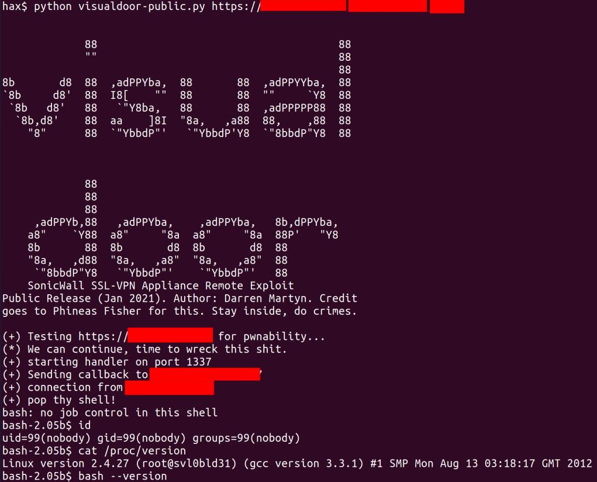

## Description
SonicWall “Virtual Office” SSL-VPN Products ship a ancient version of Bash vulnerable to ShellShock, and are therefore vulnerable to unauthenticated remote code execution (as a “nobody” user) via the /cgi-bin/jarrewrite.sh URL.

## How to RCE

## Reference
https://github.com/darrenmartyn/visualdoor

https://darrenmartyn.ie/2021/01/24/visualdoor-sonicwall-ssl-vpn-exploit
